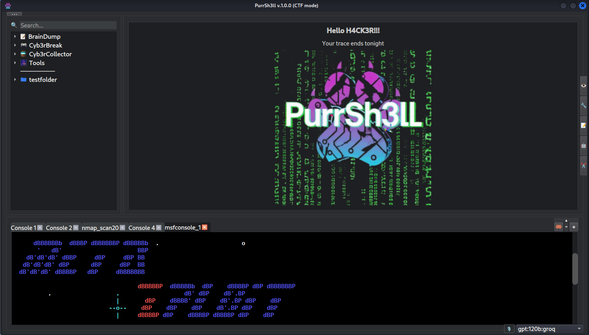
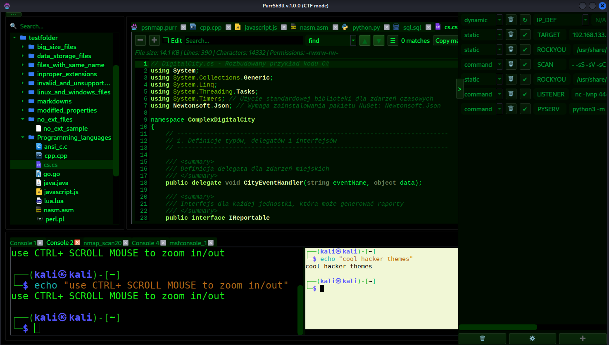
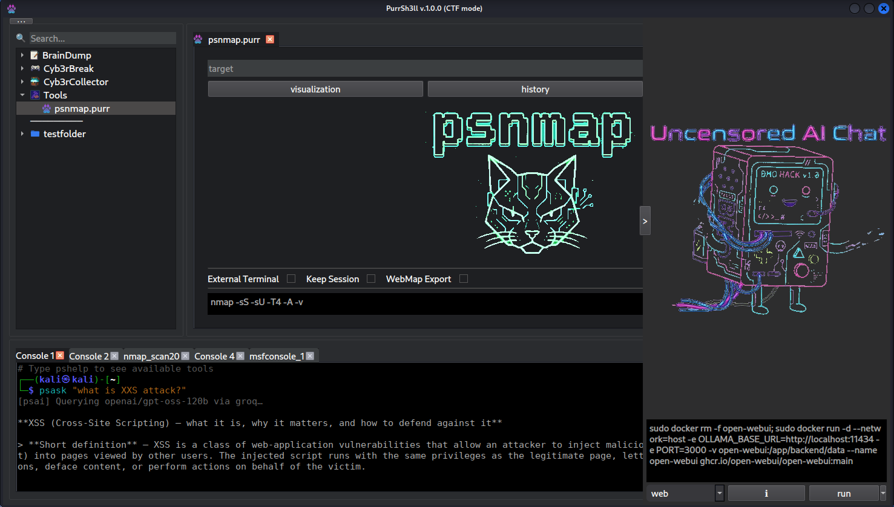

# PurrSh3ll

**AI-powered terminal environment for penetration testers, CTF players, and security learners.**

PurrSh3ll is a desktop application built on Kali Linux that brings together a multi-tab terminal, local AI assistant, RAG knowledge base, voice interface, and a suite of AI-powered CLI tools — all in one place, fully offline.



## Demo

[](https://www.youtube.com/watch?v=kpUUVxBdFqE)

https://www.youtube.com/watch?v=kpUUVxBdFqE

---

## Why PurrSh3ll?

Security professionals juggle dozens of tools, notes, and context across long engagements. PurrSh3ll keeps everything in one window and makes AI assistance available without sending sensitive data to the cloud.

- **Local-first** — your data never leaves the machine
- **Context-aware AI** — the assistant knows your terminal history and your notes
- **Built for the terminal** — not a browser, not an IDE, not a chat app

---

## Features

### Terminal
- Multi-tab Zsh terminal with per-tab renaming, zoom, and custom environment variables
- Full command history logged to JSONL with timestamps and exit codes
- Error overlay with AI-powered Explain / Fix / Analyze on failed commands

### AI Assistant (CLI)
AI tools available directly in the terminal — no GUI required:

| Command | Description |
|---------|-------------|
| `psask` | Ask the active AI profile a direct question |
| `pschat` | Persistent chat session with conversation history |
| `pscmd` | Generate a shell command from a natural language description |
| `psfix` | Explain and fix the last terminal error |
| `psnext` | Suggest next pentest steps based on terminal history |
| `pstldr` | Summarize the last command output (TL;DR) |
| `psreport` | Generate a pentest report from terminal history |
| `psrag` | Query your RAG knowledge base |
| `psview` | Analyze a screenshot or image with AI vision |
| `pshelp` | List all available tools |

Supports 7 AI providers out of the box: **Ollama, OpenAI, Anthropic, Groq, Gemini, OpenRouter, HuggingFace**. Switch between them without leaving the app.

### RAG Knowledge Base
- Index your own notes, writeups, and documentation
- Powered by ChromaDB + sentence-transformers (runs fully offline)
- Queries are automatically enriched with relevant context from your knowledge base
- File changes are tracked and re-indexed automatically via watchdog

### Voice Interface
- Wake word detection — say **"Hey Jarvis"** to activate
- Speech-to-text transcription via Faster-Whisper (tiny model, CPU, ~75 MB)
- AI generates a command from your speech
- Voice confirmation loop — say "accept" or "cancel"
- Optimized for virtual machines (queue-based audio buffering, no xruns)

### Script Manager
- Launch, organize, and document Python scripts from a GUI
- Automatic help/docstring extraction
- Per-script execution history, notes, and favorites
- Dependency detection with in-app package installation

### File Viewer
- Syntax highlighting for 40+ file types
- Chunked loading for large files
- Built-in search with regex support

### Nmap Integration
- Save and reuse scan profiles (`.psnmap` format)
- Full scan history with timestamps
- WebMap visualization via Docker

### AI Chat Panel
- Embedded web panel for Open WebUI or any OpenAI-compatible frontend
- Run and manage Docker-based LLM containers from the app
- Supports Ollama CLI profiles with custom parameters

### Additional Panels
- **Notes** — persistent side notes, auto-saved
- **Snippets** — reusable code/command snippets
- **Observable Variables** — real-time display of tracked shell variables
- **Mode Profiles** — terminal environment presets for different tasks

### Themes & Customization
PurrSh3ll ships with a large collection of built-in color themes and allows full visual customization — colors, fonts, and layout. The welcome screen (text, image, background) is editable directly from the UI with a double-click.



---

## Who Is It For?

| Audience | Key value |
|----------|-----------|
| **Penetration testers** | Local AI, pentest report generation, RAG over engagement notes |
| **CTF players** | `psnext`, `pscmd`, terminal history awareness, embedded CTF games |
| **Security students** | `psask`, `pschat`, knowledge base that grows with you |
| **Bug bounty hunters** | Organized notes, `psreport`, multi-provider AI |

PurrSh3ll is designed to grow with you — from learning to professional engagements.

---

## Requirements

- **OS:** Kali Linux (recommended), Debian/Ubuntu
- **Python:** 3.10+
- **Qt:** PyQt6 + QTermWidget
- **Optional:** Ollama (for local LLM), Docker (for Open WebUI / WebMap)
- **Optional (voice):** microphone, `portaudio`

---

## Installation

Two installers are provided depending on your needs.

### Option A — Lite (core app only)

Installs PurrSh3ll with all Python dependencies and QTermWidget. No Ollama, no Docker images, no AI skills.

```bash
bash install.sh            # without voice support
bash install.sh --voice    # with voice/audio support
```

What's included:
- Core application and all Python packages
- QTermWidget (downloaded from GitHub Releases)
- Desktop shortcut and `purrsh3ll` launch command

### Option B — Full (recommended)

Installs everything in Lite plus all optional open-source components.

```bash
bash install_full.sh             # with voice support (default)
bash install_full.sh --no-voice  # skip voice/audio
```

What's included, on top of Lite:
- **Ollama** — local LLM inference server
- **aichat** — CLI frontend for LLMs (multi-provider)
- **Docker** — container runtime (if not already installed)
- **Open WebUI** — web UI for Ollama (Docker image pre-pulled)
- **WebMap** — Nmap result visualizer (Docker image pre-pulled)
- **AI Skills** — `awesome-claude-skills-security` + `claude-code-pentest` (git submodules)

### Disk space requirements

| Variant | Approx. size |
|---------|-------------|
| `install.sh` (lite, no voice) | ~1.8 GB |
| `install.sh --voice` | ~1.9 GB |
| `install_full.sh --no-voice` | ~5.3 GB |
| `install_full.sh` (full + voice) | ~5.4 GB |

> Sizes include Python venv (~1.4 GB, dominated by PyQt6 + onnxruntime) and Docker images for Open WebUI and WebMap (~3 GB combined). Ollama LLM models are **not** included — each model is downloaded separately on demand (typically 2–8 GB per model).

### After installation

```bash
# Start Ollama (Full only)
ollama serve

# Pull a model (Full only)
ollama pull llama3.2

# Launch PurrSh3ll
purrsh3ll
```

> **Note:** A full `requirements.txt` with pinned versions will be added in the next release.

---

## Quick Start

```bash
# Ask AI a question directly from the terminal
psask "what is a SSRF vulnerability?"

# Generate a command from natural language
pscmd "find all SUID binaries on the system"

# Get AI suggestion for the next pentest step
psnext

# Summarize last command output
pstldr

# Query your knowledge base
psrag "how to enumerate SMB shares"

# See all available tools
pshelp
```

---

## Project Structure

```
purrsh3ll/
├── main.py                    # Entry point
├── core/
│   ├── controller.py          # Central singleton controller
│   ├── mixins/                # UI and terminal logic mixins
│   ├── rag/                   # RAG engine (chunker, embedder, indexer)
│   ├── voice/                 # Voice pipeline (wake word → STT → AI)
│   └── stylesheets/           # Modular QSS theme system
├── gui/
│   ├── builders/              # UI builder functions
│   ├── widgets/               # Custom Qt widgets
│   └── panels/                # Side panel widgets
├── file_loaders/              # Polymorphic file viewer (50+ formats)
├── appdata/
│   ├── terminal_modules/      # AI CLI tools (psask, pscmd, psrag…)
│   ├── agent_modes/           # Pentest and CTF agent skill sets
│   └── themes.json            # Theme definitions
└── appmodules/
    ├── BrainDump/             # Default RAG knowledge base
    └── Cyb3rBreak/            # Embedded CTF games
```



---

## Tech Stack

| Layer | Technology |
|-------|-----------|
| GUI | PyQt6, QTermWidget |
| Vector DB | ChromaDB |
| Embeddings | sentence-transformers (multilingual MiniLM) |
| STT | Faster-Whisper (tiny, CPU int8) |
| Wake word | OpenWakeWord |
| Audio | sounddevice, scipy |
| AI inference | ctranslate2, onnxruntime |
| File watching | watchdog |
| Web panel | PyQt6-WebEngine |

---

## Roadmap

PurrSh3ll is under active development. This is not the final form.

I have more ideas than time — building this solo alongside a full-time job means progress is steady but not instant. What's coming:

- **Function calling & agentic loops** — AI that actually executes actions, not just suggests them
- **MCP client support** — connect to the growing ecosystem of Model Context Protocol servers
- **Expanded file support** — video, audio, and binary file handling
- **Deeper pentest automation** — multi-step AI agents for recon, enumeration, and reporting
- **Better multi-agent workflows** — specialized agents collaborating on complex tasks

I’m aware there are still areas that need improvement, such as widget colors, some untested tools, and parts of the UI. I have these in mind and will be addressing them over time.

If any of this sounds useful to you — star the repo, open an issue, or contribute. Every bit of feedback helps prioritize what gets built next.

---

## License

This project is licensed under the **GNU General Public License v3.0**.

See [LICENSE](LICENSE) for the full text.

Because PurrSh3ll uses PyQt6 (GPL v3), any distribution must comply with GPL v3.
If you need to embed PurrSh3ll in a proprietary product, contact us for a commercial licensing arrangement.

---

## Contributing

Pull requests are welcome. For major changes, please open an issue first to discuss what you would like to change.

---

## Acknowledgements

- [PyQt6](https://www.riverbankcomputing.com/software/pyqt/) — Qt6 bindings for Python (GPL v3)
- [QTermWidget](https://github.com/lxqt/qtermwidget) — terminal emulator widget for Qt
- [Ollama](https://github.com/ollama/ollama) — local LLM runtime
- [Open WebUI](https://github.com/open-webui/open-webui) — web frontend for local models
- [OpenWakeWord](https://github.com/dscripka/openWakeWord) — wake word detection
- [Faster-Whisper](https://github.com/SYSTRAN/faster-whisper) — efficient Whisper implementation
- [ChromaDB](https://github.com/chroma-core/chroma) — vector database
- [WebMap](https://github.com/SabyasachiRana/WebMap) — Nmap result visualization
