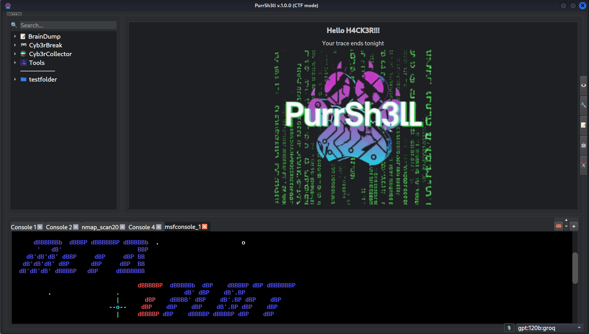
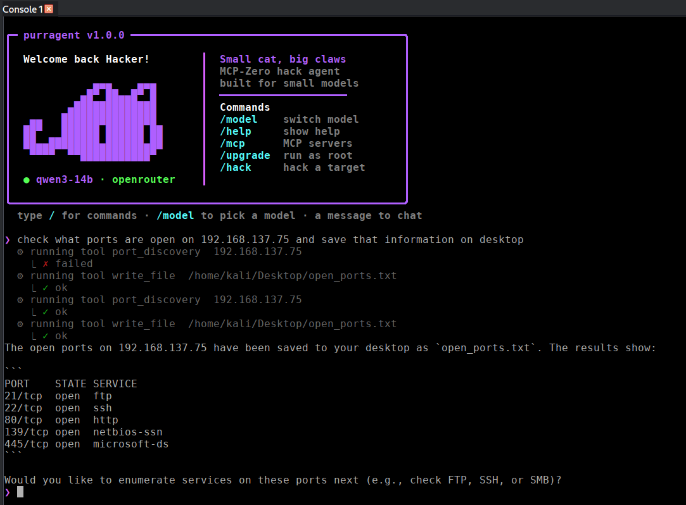
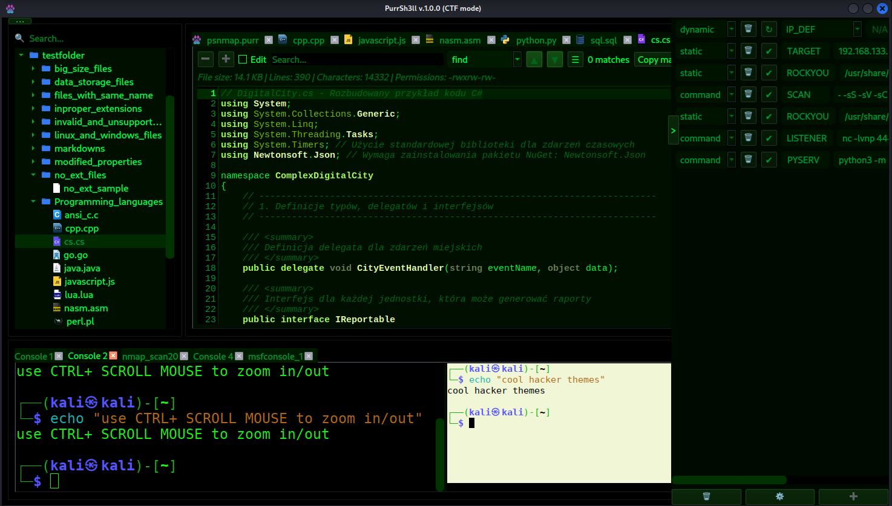
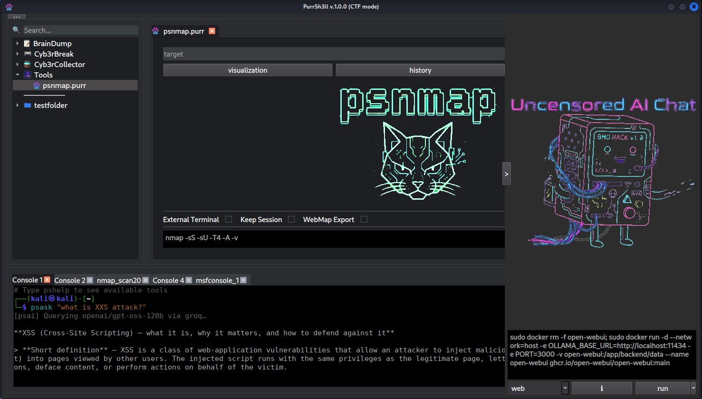

# PurrSh3ll

**A ready-made, offline-first workspace for hacking, CTFs, and security learning.**

[](https://github.com/PurrSh3ll/purrsh3ll/actions/workflows/tests.yml)

> **Kali Linux gives you the pentest _system_. PurrSh3ll gives you a ready _environment_ to work and learn in it** — friendlier than a bare terminal for beginners, more automated for pros.

PurrSh3ll turns your terminal into an integrated workspace: a **local AI** that knows your history and notes, a **searchable knowledge base** you build as you go, **executable runbooks**, and a suite of AI-powered CLI tools — all in one window, and **fully offline** if you want it. Nothing like it exists off the shelf.



## ★ What makes it different

- **🧠 Your own knowledge base, inside the terminal.** Index your notes, writeups and PDFs into a local RAG store and query them straight from the shell (`psrag`) — and every AI answer is automatically enriched with the relevant bits. Your notes stop being a dead folder and become something the AI *uses*.
- **📄 Executable markdown (`.purr`).** Write runbooks where the commands actually **run**. Cheatsheets, notes and scripts become one living document — perfect for learning ("how I rooted this box") and for repeatable pro workflows.
- **⚡ Auto-injected environment variables.** Set `$IP`, `$USER` and friends once; they're injected into your commands automatically. No more re-`export`-ing the target every session.
- **🔒 Local-first, security-native AI.** Runs entirely offline with Ollama — secrets are redacted from logs, API keys live in the OS keyring, and one dialog wipes everything. **Safe to point at real client data**, unlike cloud chatbots.
- **🎯 A history that works for you.** Every command's output is parsed for **findings, credentials, hosts, ports, CVEs and flags** into a searchable SQLite store — and a failed command gets one-click AI **Explain / Fix / Analyze**.
- **🤖 An offensive AI agent, built in (`purragent`).** A tool-using agent tuned for **small local models** that plans its own recon → exploitation workflow, and connects **unlimited MCP tools without prompt bloat** thanks to RAG-based tool discovery.

**Two audiences, one tool:** beginners get a friendlier, guided way into cyber and HTB; advanced users get automation, offline AI, and one window instead of five — because the same features scale from "learning" to "professional engagement".

## Demo

[](https://www.youtube.com/watch?v=kpUUVxBdFqE)

https://www.youtube.com/watch?v=kpUUVxBdFqE

---

<details>
<summary><b>Why not just use ChatGPT + Obsidian + Claude Code?</b></summary>

That's exactly the stack most people run — in three separate windows, all cloud. PurrSh3ll folds it into one, and keeps it local:

| Instead of… | PurrSh3ll |
|---|---|
| Copy-pasting your terminal into **ChatGPT** | AI in your terminal, aware of your history — and local, so it works on client data |
| **Obsidian** for notes | RAG over your own notes, queried straight from the shell |
| **Claude Code** | Claude Code integration built in — skills, goals, and agent behaviors, launched with one click |

</details>

---

## Features

<sub>The sections below are the full, detailed feature reference. Skim the headers, or jump to [Installation](#installation) and [Quick Start](#quick-start).</sub>

### Terminal
- Multi-tab Zsh terminal with per-tab renaming, zoom, and custom environment variables
- **SQLite command history** (`terminal_history.db`) with timestamps, exit codes, working directory, and **auto-extracted findings, targets, and open ports** (credentials, hashes, CVEs, flags, hosts) parsed from tool output
- `pshistory` to query it: recent commands, search, `--findings`, `--targets`, `--stats`, filter by phase tag
- Error overlay with AI-powered **Explain / Fix / Analyze** on failed commands — the fixer even reads the failed ps\* tool's own `-h` to propose a valid invocation
- Command Palette (`Ctrl+P`) for fast navigation

### AI Assistant (CLI)
AI tools available directly in the terminal — no GUI required:

| Command | Description |
|---------|-------------|
| `psask` | Ask the active AI profile a direct question |
| `pschat` | Persistent chat session with conversation history |
| `pscmd` | Generate a shell command from a natural-language description |
| `psfix` | Explain and fix the last terminal error |
| `psnext` | Suggest next pentest steps based on terminal history |
| `pstldr` | Summarize the last command output (TL;DR) |
| `psreport` | Generate a pentest report from terminal history |
| `psrag` | Query your RAG knowledge base |
| `psview` | Analyze a screenshot or image with AI vision |
| `pshistory` | Query the terminal history database (findings, targets, stats) |
| `pshunter` | Guided recon workflow — concurrent host discovery and port enumeration |
| `pshelp` | List all available tools |

**20 AI providers out of the box** (plus a generic OpenAI-compatible "custom" endpoint) — switch between them without leaving the app:

- **Local:** Ollama, llama.cpp, LM Studio, Jan, koboldcpp
- **Cloud:** OpenAI, Anthropic, Groq, Gemini, OpenRouter, Mistral, DeepSeek, xAI, Cerebras, Together AI, Perplexity, Fireworks AI, NVIDIA, Z.ai, HuggingFace

Per-profile controls: **function calling** (tool use), **temperature**, disable/hide model "thinking", RAG enrichment, and advanced custom parameters. Context-window awareness drives a live token/percentage indicator so you can see how full the model's context is.

### RAG Knowledge Base
- Index your own notes, writeups, documentation, and PDF files
- Powered by ChromaDB + fastembed — runs fully offline
- Choose from 30+ embedding models grouped by category: English, Multilingual, Language-specific, Code, and Vision/Multimodal
- Optional reranking with 6 reranker models for improved precision
- Configurable file-extension filter (PDF, TXT, MD, RST, CSV, JSON, XML, YAML, code files, and more)
- Per-file include/exclude manager — selectively disable indexing of specific files
- Queries in `psask`, `pschat`, and `psrag` are automatically enriched with relevant context
- File changes are tracked and re-indexed automatically via watchdog; indexing progress shows in the status bar
- **Ask the AI about PurrSh3ll itself** — index the bundled app guide and query the app's entire functionality from `psask`/`psrag`

### Security & Privacy
- **Local-first** — with Ollama or another local runtime, nothing is sent off the machine
- **Erase all data** (Edit → *Erase all data…*) — one dialog to permanently wipe exactly what you choose: command-history DB, AI chat sessions, RAG index, analyzed images, app logs, side-panel notes, snippets, saved variables, **API keys** (OS keyring + file), and optionally **all Docker containers**. Guarded by a type-`ERASE`-to-confirm plus a per-category report
- **API keys in the OS keyring** (with an encrypted-at-rest file fallback), never printed to history or logs
- **Secret redaction** — diagnostic logs scrub API keys / tokens before anything hits disk
- ps\* tool output is isolated so it never leaks into generated reports

### Voice Interface
- Wake-word detection — say **"Hey Jarvis"** to activate
- Speech-to-text via Faster-Whisper (tiny model, CPU, ~75 MB)
- AI generates a command from your speech, then a voice confirmation loop — say "accept" or "cancel"
- Optimized for virtual machines (queue-based audio buffering, no xruns)

### Script Manager
- Launch, organize, and run Python and `.purr` scripts from a GUI
- **Full-screen code view** — one click hides all controls and gives the editor the whole panel for reading/analyzing code
- Per-script **notes**, plus generated **help / readme** tabs
- Dependency detection with in-app package installation
- Run in the current terminal, a new tab, or an external terminal; priority, timeout, background, and output-redirect helpers

### File Viewer
- Syntax highlighting for 500+ languages via Pygments
- CSV/TSV rendered as interactive sortable tables
- PDF with page navigation; audio and video playable directly in the app
- Image viewer with zoom, animated GIF/WEBP, and EXIF/metadata + MD5/SHA256 via exiftool
- **Interactive Markdown** — docs can carry clickable actions that run a command, switch theme, or open an app window (used by the built-in first-steps guide)
- Game files (`.game`) with a dedicated launcher
- Chunked loading for large files; built-in search with regex

### Nmap Integration
- Save and reuse scan profiles in the `.purr` format
- WebMap visualization via Docker, with a **full-screen visualization view** (Back + WebMap token button)
- Runs scans in the embedded terminal or an external one

### pshunter — guided recon workflow
- Phase-driven recon runner in the terminal (`pshunter`, help via `pshunter -h`): **host discovery** and **port enumeration** wired, service detection / vuln scan / CVE lookup / exploitation to come
- Runs multiple nmap scans **concurrently** (fast + full TCP split + UDP) streaming to its own SQLite store; browse hosts and per-host ports/services under `[d] database`
- `v <n>` replays a scan's command + real output in a spawned terminal for report screenshots; `[u] upgrade` re-runs under `sudo` for SYN/UDP without losing progress

### purragent — autonomous offensive AI agent (console)

A purpose-built, tool-using AI agent that lives in the terminal and plans its own work in a bounded ReAct loop — my own agent, tuned for offensive security and for **small local models** (e.g. qwen3-14b), not a wrapper around a hosted assistant.



- **Two modes.** A **general-purpose assistant** that reasons, calls tools, and gets things done — not limited to security work: it handles everyday tasks (files, scripting, research, quick automation) just as well as pentest/HTB workflows. And an autonomous **hacking mode** (`/hack`) that drives a full recon → enumeration → exploitation → privilege-escalation pipeline against a target and pursues the flag with minimal hand-holding.
- **Plans and tracks its own progress.** Keeps a model-managed to-do plan (`update_plan`), a running findings log (`save_finding`) of credentials/hosts/loot it discovers, and short-term session memory (`save_memory`) — so it stays coherent across many steps instead of forgetting what it already tried.
- **Connect unlimited MCP servers — RAG tool discovery.** Add as many [MCP](https://modelcontextprotocol.io) servers and tools as you like; there is **no practical limit and no context bloat**. Instead of stuffing every tool schema into the prompt (which overflows the window and degrades small models), purragent indexes all available tools and **semantically retrieves only the few relevant to the current step**. Bring your own recon, exploitation, or custom tooling as MCP servers and the agent will surface them on demand — the more you connect, the more capable it gets, without paying for it in the prompt.
- **Works with any backend.** Speaks both OpenAI-compatible and **native Anthropic** (`/v1/messages`) tool-calling APIs, so it runs the same whether you point it at a local model or a cloud provider. The whole transcript is bounded to the model's context window, and oversized tool/file output is marked as truncated rather than silently cut.

### AI Chat Panel
- Embedded web panel for Open WebUI or any OpenAI-compatible frontend
- Launch and manage Docker-based LLM containers from the app (auto-cleanup on stop)
- Supports Ollama CLI profiles with custom parameters, system prompt, and temperature

### Additional Panels
- **Notes** — persistent side notes, auto-saved
- **Snippets** — reusable command/code snippets, runnable in the current or a new terminal
- **Observable Variables** — real-time display of tracked shell variables
- **Mode Profiles** — terminal environment presets for different tasks
- **Agent modes** — deployable CTF / pentest `CLAUDE.md` profiles and skill sets for Claude Code

### Themes & Customization
PurrSh3ll ships with a large collection of built-in color themes and allows full visual customization — colors, fonts, and layout. The welcome screen (text, image, background) is editable directly from the UI with a double-click.



### Cyb3rBreak
An optional, isolated collection of classic arcade games for downtime during long scans. On-brand, not a distraction from the real workflow.

---

## Who Is It For?

| Audience | Key value |
|----------|-----------|
| **Penetration testers** | Local AI, report generation, RAG over engagement notes, one-click data wipe |
| **CTF players** | `psnext`, `pscmd`, history-aware suggestions, findings/flags extraction |
| **Security students** | `psask`, `pschat`, a knowledge base that grows with you, ask-the-app onboarding |
| **Bug bounty hunters** | Organized notes, `psreport`, 20 AI providers to choose from |

PurrSh3ll is designed to grow with you — from learning to professional engagements.

---

## Requirements

- **OS:** Kali Linux (recommended), Debian/Ubuntu
- **Python:** 3.10+
- **Voice (optional hardware):** microphone

All other dependencies (PyQt6, QTermWidget, Ollama, Docker, etc.) are installed by `install.sh`.

**RAM usage:**

| Configuration | RAM |
|---------------|-----|
| App only (idle to multiple tabs + browser) | 200 MB – 1 GB |
| + RAG embedding model (during indexing) | +90 MB – 2.3 GB (depends on model) |
| + RAG reranking model (during reranking) | +100 – 400 MB (depends on model) |
| + Voice (during recognition) | +300 – 600 MB |
| + Open WebUI (Docker) | +500 MB – 1 GB |
| + WebMap (Docker) | +200 – 400 MB |
| Full stack with a large LLM model (~8B) | ~12 GB+ |

---

## Installation

PurrSh3ll ships with an interactive installer that lets you choose exactly which components to install.

```bash
bash install.sh          # interactive — pick components via checklist
bash install.sh --auto   # non-interactive — install everything
```

The core app, Python packages, and QTermWidget are always installed. Optional components you can select:

| Component | Description |
|-----------|-------------|
| **Ollama** | Local LLM inference server |
| **aichat** | CLI frontend for LLMs (multi-provider) |
| **Docker** | Container runtime |
| **Open WebUI** | Web UI for Ollama (Docker image) |
| **WebMap** | Nmap result visualizer (Docker image) |
| **Voice support** | Microphone, portaudio, Faster-Whisper |
| **AI Skills** | Cybersecurity skill/agent sets for Claude Code |
| **cyber games** | Hacker-style mini-games for the Cyb3rBreak module |

> ☕ **Note:** A full installation with all components may take **15–40 minutes** depending on your internet speed. Ollama and Docker images are downloaded during the process. Grab a big coffee — you'll need it.

### Disk space requirements

| Variant | Approx. size |
|---------|-------------|
| Core only (no voice) | ~1.8 GB |
| Core + voice | ~1.9 GB |
| Core + embedding model | ~2.0 GB |
| Full (no voice, no embed model) | ~5.3 GB |
| Full (no voice) | ~5.5 GB |
| Full + voice | ~5.6 GB |

> Sizes include the Python venv (~1.4 GB, dominated by PyQt6 + onnxruntime) and Docker images for Open WebUI and WebMap (~3 GB combined). The default embedding model (`paraphrase-multilingual-MiniLM-L12-v2`, ~220 MB) is optional during install — if skipped, it is downloaded automatically on first RAG use. Ollama LLM models are **not** included — each is pulled separately on demand (typically 2–8 GB per model).

### After installation

```bash
# Start Ollama (Full only)
ollama serve

# Pull a starter model (Full only)
ollama pull gemma4:e2b     # light and fast, great for CPU-only

# Launch PurrSh3ll
purrsh3ll
```

A `requirements.txt` with the full dependency list is included for reference.

---

## Quick Start

```bash
# Ask AI a question directly from the terminal
psask "what is a SSRF vulnerability?"

# Generate a command from natural language
pscmd "find all SUID binaries on the system"

# Get an AI suggestion for the next pentest step
psnext

# Summarize last command output
pstldr

# Query your knowledge base
psrag "how to enumerate SMB shares"

# See all available tools
pshelp
```

New here? Open **FIRST_STEPS.md** in the app — its commands, themes, and "Open AI Settings" links are clickable.

---

## Project Structure

```
purrsh3ll/
├── main.py                    # Entry point
├── core/
│   ├── controller.py          # Central singleton controller
│   ├── mixins/                # UI and terminal logic mixins
│   ├── rag/                   # RAG engine (chunker, embedder, indexer)
│   ├── voice/                 # Voice pipeline (wake word → STT → AI)
│   ├── db/                    # SQLite terminal history + output parser
│   └── data_wipe.py           # "Erase all data" registry + executor
├── gui/
│   ├── builders/              # UI builder functions
│   ├── widgets/               # Custom Qt widgets
│   ├── dialogs/               # Settings, erase-data, palette, …
│   ├── panels/                # Side panel widgets
│   └── watchers/              # Filesystem / module watchers
├── file_loaders/              # Polymorphic file viewer (50+ formats)
├── appdata/
│   ├── terminal_modules/      # AI CLI tools + purragent console agent (psask, pscmd, psrag, pshunter…)
│   ├── mcp_servers/           # MCP tool servers used by purragent (hacktools, …)
│   ├── agent_modes/           # Pentest and CTF agent skill sets
│   └── themes.json            # Theme definitions
└── appmodules/
    ├── BrainDump/             # Default RAG knowledge base
    ├── Cyb3rBreak/            # classic arcade games (downtime)
    └── Cyb3rCollector/        # Organized output (listeners, stagers, reports)
```



---

## Tech Stack

| Layer | Technology |
|-------|-----------|
| GUI | PyQt6, QTermWidget |
| Vector DB | ChromaDB |
| Embeddings | fastembed (30+ models: English, Multilingual, Code, Vision) |
| History | SQLite (findings/targets/ports auto-extraction) |
| STT | Faster-Whisper (tiny, CPU int8) |
| Wake word | OpenWakeWord |
| Audio | sounddevice, scipy, mutagen |
| PDF | PyMuPDF (fitz) |
| AI inference | ctranslate2, onnxruntime |
| Secrets | keyring (OS credential store) |
| File watching | watchdog |
| Web panel | PyQt6-WebEngine |
| Console agent | prompt_toolkit + rich REPL, MCP (Model Context Protocol) tool servers |

---

## Roadmap

PurrSh3ll is under active development — this is not its final form.

It's a solo project built after hours alongside a full-time job. The app is still being actively tested and improved.

---

## License

This project is licensed under the **GNU General Public License v3.0**.

See [LICENSE](LICENSE) for the full text.

Because PurrSh3ll uses PyQt6 (GPL v3), any distribution must comply with GPL v3.
If you need to embed PurrSh3ll in a proprietary product, contact us for a commercial licensing arrangement.

---

## Contributing

Pull requests are welcome. For major changes, please open an issue first to discuss what you would like to change.

---

## Acknowledgements

- [PyQt6](https://www.riverbankcomputing.com/software/pyqt/) — Qt6 bindings for Python (GPL v3)
- [QTermWidget](https://github.com/lxqt/qtermwidget) — terminal emulator widget for Qt
- [Ollama](https://github.com/ollama/ollama) — local LLM runtime
- [Open WebUI](https://github.com/open-webui/open-webui) — web frontend for local models
- [OpenWakeWord](https://github.com/dscripka/openWakeWord) — wake word detection
- [Faster-Whisper](https://github.com/SYSTRAN/faster-whisper) — efficient Whisper implementation
- [ChromaDB](https://github.com/chroma-core/chroma) — vector database
- [WebMap](https://github.com/SabyasachiRana/WebMap) — Nmap result visualization
- [fastembed](https://github.com/qdrant/fastembed) — lightweight, fast embedding library
- [Pygments](https://github.com/pygments/pygments) — syntax highlighting for 500+ languages
