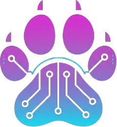

# PurrSh3ll — User Guide



**PurrSh3ll** is an AI-powered desktop environment for penetration testers and security researchers. It combines a terminal emulator, AI assistant, RAG knowledge base, script manager, and note-taking system into a single unified interface.

---

## Table of Contents

1. [Getting Started](#getting-started)
2. [Interface Layout](#interface-layout)
3. [Terminal](#terminal)
4. [AI Tools — ps* Commands](#ai-tools--ps-commands)
5. [Chat Panel](#chat-panel)
6. [RAG Knowledge Base](#rag-knowledge-base)
7. [Script Manager](#script-manager)
8. [Notes](#notes)
9. [File Viewer](#file-viewer)
10. [Environment Variables & Aliases](#environment-variables--aliases)
11. [Voice Control](#voice-control)
12. [Themes & Customization](#themes--customization)
13. [AI Settings](#ai-settings)
14. [Session & Behavior](#session--behavior)

---

## Getting Started

Launch PurrSh3ll from the terminal or desktop shortcut:

```bash
purrsh3ll
```

On first launch the welcome screen is shown. Double-click it to customize the welcome text, image, or background.

Type `pshelp` in any terminal to see all available AI tools.

---

## Interface Layout

The interface is divided into three main areas:

- **Left panel** — Chat, Script Manager, Notes, File Viewer, Environment Variables
- **Center** — Terminal tabs and execution area
- **Right panel** — Secondary tools and output

Panels can be resized by dragging the splitters. Layouts adapt to the current mode.

---

## Terminal

PurrSh3ll uses a real terminal emulator (QTermWidget / zsh). Multiple tabs are supported.

**Tab management:**
- Open a new tab: `Ctrl+T` or the `+` button
- Close a tab: `Ctrl+W`
- Switch between tabs: `Ctrl+Tab`

**Terminal history** is saved automatically to `appdata/logs/terminal_history.jsonl`. This history is used by AI tools like `psfix`, `psnext`, and `psreport` to provide context-aware responses.

---

## AI Tools — ps* Commands

PurrSh3ll includes a suite of AI-powered terminal commands. All tools use the active AI provider configured in **Settings → AI Settings → API Providers**.

Type `pshelp` to list all available tools and their usage.

---

### psai — AI Assistant

General-purpose AI assistant. Two modes available:

```bash
psai ask "explain what is SSRF"
psai chat                        # interactive conversation
```

Supports streaming output and multi-turn conversations.

---

### pscmd — Command Generator

Describe what you want to do in plain English and get the shell command:

```bash
pscmd "find all SUID binaries on the system"
pscmd "scan ports 80 and 443 on 192.168.1.0/24 with nmap"
```

The generated command is printed and ready to copy or execute.

---

### psfix — Error Explainer

Automatically reads the last failed command from terminal history and asks the AI to explain the error and suggest a fix:

```bash
psfix
psfix --last 3    # analyze last 3 commands
```

---

### psnext — Pentest Advisor

Reads recent terminal history and suggests the most promising next steps for the current engagement:

```bash
psnext
psnext --last 20    # use last 20 commands as context
```

Useful when you are stuck or want a second opinion on attack paths.

---

### psrag — RAG Query

Query your local knowledge base and receive an AI-synthesized answer:

```bash
psrag "how to enumerate SMB shares"
psrag -n 5 "SQL injection bypass techniques"
psrag --show-sources "lateral movement with pass the hash"
```

Flags:
- `-n N` — number of chunks to retrieve (default: 3)
- `--show-sources` — print the source files used
- `-m MODEL` — override the model for this query

---

### pstldr — TL;DR Summarizer

Summarize any text, file, or piped output:

```bash
pstldr report.txt
nmap -sV 10.10.10.1 | pstldr
pstldr "paste long text here..."
```

---

### psview — Image / Screenshot Analyzer

Send a screenshot or image to a vision-capable AI model for analysis:

```bash
psview screenshot.png
psview screenshot.png --next    # also suggest next pentest steps
```

Analysis results are saved to terminal history so `psnext` and `psreport` can use them.

---

### psreport — Pentest Report Generator

Generate a structured Markdown/HTML pentest report from terminal history:

```bash
psreport                  # fast mode — smart-filtered history
psreport --deep           # thorough Map-Reduce mode (multiple LLM calls)
psreport -o my_report     # custom output filename
```

Reports are saved to `appmodules/Cyb3rCollector/reports/`.

---

## Chat Panel

The Chat panel provides a GUI interface for interacting with AI. Three modes are available via the top selector:

| Mode | Description |
|------|-------------|
| **run + cli** | Launches a configured CLI tool (e.g. aichat, ollama run) in a terminal tab |
| **run + web** | Starts Open WebUI in a Docker container, opens in embedded browser |
| **connect** | Connects directly to any OpenAI-compatible API endpoint |

Configure AI profiles in **Settings → AI Settings → API Providers**.

---

## RAG Knowledge Base

PurrSh3ll includes a local Retrieval-Augmented Generation (RAG) system powered by ChromaDB and local embeddings.

**Knowledge base location:** `appmodules/BrainDump/`

Drop any files (`.md`, `.txt`, `.pdf`, `.py`, etc.) into the BrainDump folder. The system indexes them automatically via a file watcher — no manual action required.

**Query the knowledge base** with `psrag` from any terminal tab.

**Settings** (Settings → AI Settings → RAG):
- Switch between knowledge bases
- Change the embedding model
- Enable/disable auto-indexing

---

## Script Manager

Store, organize, and run Python scripts from one place.

**Features:**
- Automatic extraction of `--help` output
- Automatic extraction of docstrings
- Execution history per script
- Automatic installation of missing libraries on run
- Run scripts directly from the panel

Scripts are stored in `usermodules/` and `appmodules/`.

---

## Notes

The Notes panel supports Markdown with live rendering. Notes are stored in `notes/` and can be integrated with the application.

**Clickable action links** embedded in notes allow you to:
- Run terminal commands directly from a note
- Change the application theme

Example in a note:
```markdown
[Run nmap scan](action://run/command/nmap -sV 10.10.10.1)
[Switch to dark theme](action://change/theme/Legacy%20Hacker)
```

---

## File Viewer

Open and view files of various types directly within PurrSh3ll without leaving the application.

From any terminal tab:
```bash
psopen filename.txt
psopen /path/to/file.py
```

Supported types include text files, Markdown, Python scripts, logs, and more.

---

## Environment Variables & Aliases

Manage shell environment variables and aliases through the GUI panel.

**Features:**
- Create, edit, and delete variables and aliases
- Apply to all terminal tabs simultaneously (configurable in Settings)
- Saved automatically and restored on next launch

---

## Voice Control

Voice control requires optional voice packages (installed with `--voice` flag).

**Capabilities:**
- **Wake word detection** — activate listening hands-free
- **Speech-to-text** — Whisper-based transcription
- **Voice commands** — control the application or query AI by speaking

Voice settings are accessible in the settings panel. The voice button in the toolbar activates/deactivates listening.

---

## Themes & Customization

PurrSh3ll includes multiple built-in themes. Switch from Settings or from a terminal:

**Available themes include:**
- Default
- Legacy Hacker
- Cyberpunk
- Red Team
- and more

**Welcome screen customization:**
Double-click the welcome screen to open the editor. You can set:
- **Text** — custom welcome message (rotates hacker quotes every 10s by default)
- **Image** — display a custom image or GIF
- **Background** — set a background image or GIF for the welcome area

---

## AI Settings

Access via **Settings → AI Settings**.

### API Providers

Configure one or more AI provider profiles:

| Field | Description |
|-------|-------------|
| Provider | `ollama`, `openai`, `anthropic`, `groq`, `gemini`, `openrouter`, `huggingface` |
| Model | Model name (e.g. `llama3.2`, `gpt-4o`, `claude-opus-4-5`) |
| URL | Base URL of the API endpoint |
| API Key | Stored securely in system keyring |

Multiple profiles can be created and switched between.

### Agent Mode

Set the AI agent behavior profile:
- **Agent Role** — defines the system prompt and workflow (e.g. `pentest_mode`, `ctf_mode`)
- **Skills Set** — loads a specific set of AI skills and context files

### LLM CLI Path

Path to an external CLI tool (e.g. `aichat`) used in `run + cli` chat mode.

---

## Session & Behavior

Configurable in **Settings → Behavior**:

| Setting | Description |
|---------|-------------|
| Restore session at start | Re-open terminal tabs from the previous session |
| Save environment variables at close | Persist env vars between sessions |
| Apply env vars to all terminals | Sync variables across all open tabs |
| Delete logs at close | Clear terminal history log on exit |
| Delete notes at close | Clear notes on exit |
| Terminal history max entries | Maximum number of entries saved to history |

---

*PurrSh3ll is under active development. New features and modules are added regularly.*
