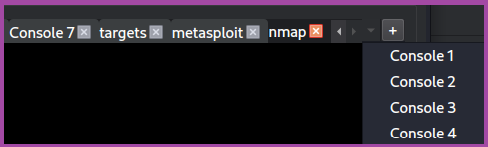
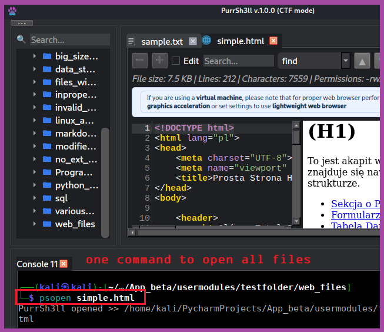
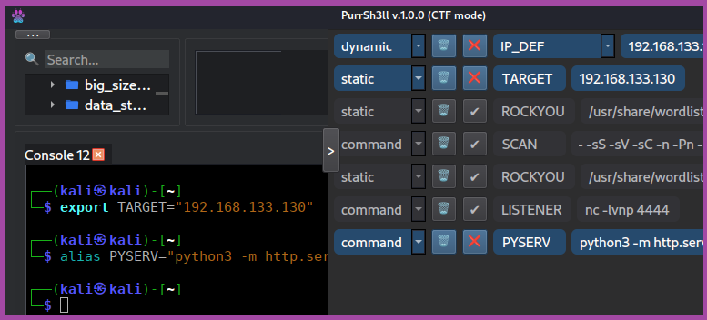
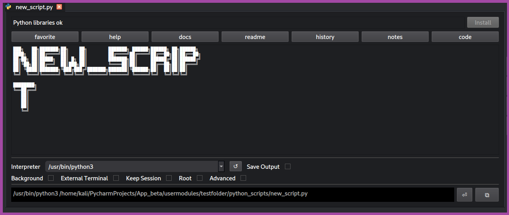
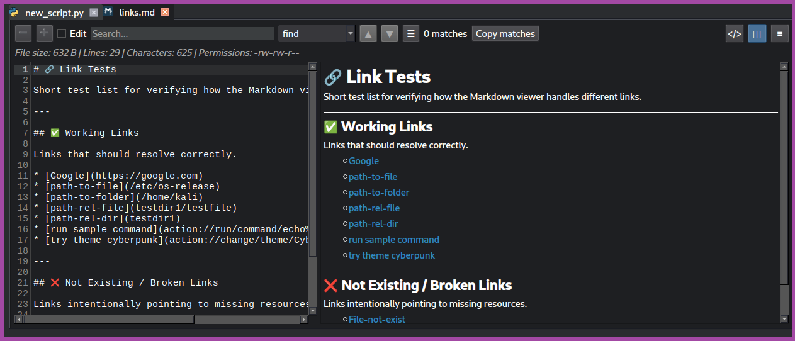
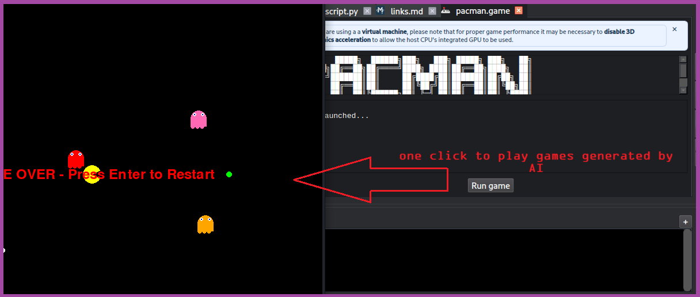

# 🐾 PurrSh3ll – User Guide

## 📌 Overview

**PurrSh3ll** is a desktop GUI application designed for pentesters, developers, and power users who want to build their own customizable working environment.

It combines a terminal, script manager, documentation system, and environment configuration into a single interface that feels like a lightweight IDE tailored for offensive security workflows.

---

## 🎯 Key Features

### 🖥️ Integrated Terminal

* Built-in terminal inside the GUI
* Execute commands directly without leaving the app
* Easy manage multiple terminals
* Built-in terminal commands:
  * `psopen` — open any file in PurrSh3ll directly from the terminal
    * [psopen --help](action://run/command/psopen%20-h%0A)
  * `psrag` — query the RAG knowledge base and get an AI answer via Ollama
    * [psrag --help](action://run/command/psrag%20-h%0A)

### 📂 Python Script Management

* Store and organize your scripts in one place
* Automatic extraction of help
* Automatic extraction of docstrings
* Automatic instalation of missing libaries
* Track execution history of scripts

### 🧠 Smart Documentation

* Markdown notes support
* Easy integration notes with application
* Execute code directly from notes using the integrated terminal
  * [try this :)](action://run/command/cmatrix%20-ab%0A)

### ⚙️ Environment Customization

* Create your own workspace with:
  * Custom aliases
  * Environment variables
  * Personal scripts
* Easy environment variable management

### 🧩 Multi-file Support

* Open and work with multiple file types
* Smooth navigation between files and scripts

### 🎲 Play Games

* Application can run games based on pygame library

### 🎨 Hacker-Themed UI

* Multiple visual themes inspired by hacker aesthetics
* Customize the look of your workspace
* Just try some of them right now:
  * [matrix](action://change/theme/Legacy%20Hacker)
  * [cyberpunk](action://change/theme/Cyberpunk)
  * [red team](action://change/theme/Red%20Team)
  * [default](action://change/theme/default)

### 🔌 Extensibility (Future)

* Planned support for additional modules
* Dedicated pentesting tools and automation features

---

## 🧭 Interface Overview

PurrSh3ll provides a clean GUI layout similar to a development environment:

* **Multiple terminals**
* **File Editor**
* **Managing envs/aliases**
* **Python scripts run in Python Runner mode**

---

## 👥 Who Is It For?

PurrSh3ll is designed for:

* 🟢 Beginners

  * Simplifies working with scripts and environments
  * Reduces setup complexity

* 🔴 Advanced Users / Pentesters

  * Enables automation workflows
  * Centralizes tools, scripts, and notes

---

## 💡 Example Use Cases

* Store python scripts
* Store notes which are integrated with application
* Quickly execute commands from one place
* Build script pipelines
* Use environment variables for dynamic workflows
* Run small projects or games
* Make your screen more readable
* Open any file instantly with `psopen` without leaving the terminal
* Query your knowledge base and get AI answers with `psrag`

---

## 👀 How it looks

* Managing multiple terminals

* Open and edit files

* Manage environment variables and aliases

* Python Runner

* Markdown integration

* Play Games

* 

---

## ⚠️ Notes

* The application is Linux-based
* Focused on productivity and workflow organization
* Designed to grow with modular extensions in the future

---

## 🚀 Summary

PurrSh3ll is more than just a terminal — it’s a customizable environment where you can:

* Manage scripts
* Document your work
* Automate tasks
* Build your own pentesting toolkit

All in one place.

---

*End of User Guide*
