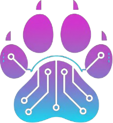

# PurrSh3ll — User Guide



**PurrSh3ll** is an AI-powered desktop environment for penetration testers and security researchers. It combines a terminal emulator, AI assistant, RAG knowledge base, script manager, file viewer, and note-taking system into a single unified interface.

---

## Table of Contents

1. [Getting Started](#getting-started)
2. [Interface Layout](#interface-layout)
3. [Terminal](#terminal)
4. [AI Tools — ps* Commands](#ai-tools--ps-commands)
5. [Chat Panel](#chat-panel)
6. [RAG Knowledge Base](#rag-knowledge-base)
7. [Script Manager](#script-manager)
8. [Markdown Support](#markdown-support)
9. [File Viewer](#file-viewer)
10. [Environment Variables & Aliases](#environment-variables--aliases)
11. [Voice Control](#voice-control)
12. [Themes & Customization](#themes--customization)
13. [AI Settings](#ai-settings)
14. [Session & Behavior](#session--behavior)

---

## Getting Started

Launch PurrSh3ll from the terminal or desktop shortcut:

```bash
purrsh3ll
```

On first launch the welcome screen is shown. Double-click it to customize the welcome text, image, or background.

Type `pshelp` in any terminal to see all available AI tools.

---

## Interface Layout

The interface is divided into three main areas:

- **Top menu bar** — access to Settings, Help, Licenses, and application controls
- **Left panel** — Chat, Script Manager, Notes, File Viewer, Environment Variables
- **Center** — Terminal tabs and execution area
- **Right panel** — Secondary tools and output

The left and right panels can be resized by dragging the splitters. Layouts adapt to the current mode.

---

## Terminal

PurrSh3ll uses a real terminal emulator (QTermWidget / zsh). Multiple tabs are supported and can be managed directly from the tab bar.

**Tab management:**
- Open a new tab using the `+` button in the tab bar
- Close a tab using the `×` button on the tab
- **Rename a tab** by double-clicking the tab label
- Adjust terminal font size with `Ctrl + Mouse Scroll`

**Full session recording** — every terminal session is recorded automatically to `appdata/logs/terminal_history.jsonl`. This includes executed commands and their output, giving AI tools like `psfix`, `psnext`, and `psreport` complete context of everything that happened in the terminal.

---

## AI Tools — ps* Commands

PurrSh3ll includes a suite of AI-powered terminal commands. All tools use the active AI provider configured in **File → AI Settings → Profiles**.

Type `pshelp` in any terminal to list all available tools:

[Run pshelp](action://run/command/pshelp%0A)

---

### psask — Ask AI

Ask the active AI profile a direct question.

```bash
psask "what is SSRF and how to exploit it"
psask "explain the output of this nmap scan: ..."
psask -m llama3.2 "what is privilege escalation?"
psask --rag "how to enumerate SMB shares"
psask --rag -n 10 "lateral movement techniques"
```

Flags:
- `-m <model>` — override the model from the active profile
- `--rag` — enrich the prompt with relevant chunks from the knowledge base
- `-n <N>` — number of RAG chunks to include (default: 5, used with `--rag`)

---

### pschat — Chat with AI

Start a persistent interactive chat session. History is preserved between runs.

```bash
pschat "let's analyze this target: 10.10.10.5"
pschat --new
pschat --history
pschat --clear
pschat --rag "what does my knowledge base say about SMB?"
pschat -m gemma3 "continue our analysis"
```

Flags:
- `--new` — clear history and start a new session
- `--clear` — clear history and exit
- `--history` — show current conversation history
- `--rag` — enrich the message with RAG context
- `-n <N>` — number of RAG chunks (default: 5)
- `-m <model>` — override the model

---

### pscmd — Command Generator

Describe what you want to do in plain English and get the shell command.

```bash
pscmd "find all SUID binaries on the system"
pscmd "scan ports 80 and 443 on 192.168.1.0/24 with nmap"
pscmd "compress the /var/log directory to a tar.gz archive"
pscmd -m qwen3 "list all listening TCP ports"
```

Flags:
- `-m <model>` — override the model

---

### psfix — Error Explainer

Reads the last failed command from terminal history and asks the AI to explain the error and suggest a fix.

```bash
psfix
psfix --explain
psfix --analyze
```

Flags:
- `--explain` — explain why the command failed without suggesting a fix
- `--analyze` — deep mode with full terminal history and current directory context
- `-m <model>` — override the model

---

### psnext — Pentest Advisor

Reads recent terminal history and suggests the most promising next steps for the current engagement.

```bash
psnext
psnext --target 192.168.1.0/24
psnext -m llama3.2
```

Flags:
- `--target <TARGET>` — specify the target IP, hostname, or range for better suggestions
- `-m <model>` — override the model

Useful when you are stuck or want a second opinion on attack paths.

---

### psrag — RAG Query

Query your local knowledge base and receive an AI-synthesized answer enriched with relevant document chunks.

```bash
psrag "how to enumerate SMB shares"
psrag "SQL injection bypass techniques"
psrag "lateral movement techniques"
```

---

### psreport — Pentest Report Generator

Generate a structured Markdown or HTML pentest report from terminal history. Reports are saved to `appmodules/Cyb3rCollector/reports/`.

```bash
psreport
psreport --deep
psreport --full
psreport --verbose
psreport --format html
psreport --target 192.168.1.0/24
psreport --title "Internal Network Pentest"
psreport --target 10.10.10.5 --format html --verbose
```

Flags:
- `--deep` — Map-Reduce mode: processes full history in chunks (N+1 LLM calls, thorough)
- `--full` — include full history without smart-filtering for pentest keywords
- `--verbose` — stream the report to terminal while saving
- `--format md|html` — output format (default: md)
- `--target <TARGET>` — target IP or range shown in report header
- `--title <TITLE>` — custom report title
- `-m <model>` — override the model

---

### pstldr — TL;DR Summarizer

Summarize the last command output, a file, or piped input.

```bash
pstldr
pstldr report.txt
pstldr --tail /var/log/syslog
nmap -sV 10.10.10.1 | pstldr
pstldr -m gemma3 report.txt
```

Flags:
- `--tail` — read from the end of the file (useful for logs)
- `-m <model>` — override the model

---

### psview — Image / Screenshot Analyzer

Send a screenshot or image to a vision-capable AI model for analysis. Requires a vision-capable model (e.g., llava, gpt-4o, gemini-pro-vision).

```bash
psview screenshot.png
psview /tmp/scan.png "what services are running?"
psview screenshot.png --cmd
psview screenshot.png --next
psview -m gpt-4o screenshot.png
```

Flags:
- `--cmd` — analyze the image and paste the best suggested command into the terminal
- `--next` — analyze the image and suggest next pentest steps using full history
- `-m <model>` — override the model (must support vision)

Supported formats: PNG, JPG, JPEG, WEBP, GIF.

Analysis results are saved to terminal history so `psnext` and `psreport` can use them.

---

### psopen — Open File in PurrSh3ll

Open any file in the PurrSh3ll file viewer directly from the terminal. If the path is a directory, it opens in the system file manager.

```bash
psopen notes.md
psopen /tmp/report.txt
psopen -f /tmp/exploit.py
psopen -f /tmp/data.json -m json
psopen --help
```

Flags:
- `-f, --file <file>` — path to the file to open
- `-m, --mode <mode>` — override viewer mode (e.g., py, sh, js, json, md, txt)
- `-h, --help` — show help

---

### pshelp — List All Tools

```bash
pshelp
```

Displays all available `ps*` commands with short descriptions.

---

## Chat Panel

The Chat panel provides a GUI interface for interacting with AI. Three modes are available via the top selector:

| Mode | Description |
|------|-------------|
| **run + cli** | Launches a configured CLI tool (e.g. aichat, ollama run) in a terminal tab |
| **run + web** | Starts Open WebUI in a Docker container, opens in embedded browser |
| **connect** | Connects directly to any OpenAI-compatible API endpoint |

Configure AI profiles in **File → AI Settings → Profiles**.

> **Note:** When using **run + web** mode, Open WebUI runs inside a Docker container and may take **30–60 seconds** to start, especially on first launch. If you see a blank or loading page, wait for the container to fully initialize.
>
> To check if the container is running:
> ```bash
> docker ps | grep open-webui
> ```
> To check startup logs:
> ```bash
> docker logs open-webui --tail 50
> ```

---

## RAG Knowledge Base

PurrSh3ll includes a local Retrieval-Augmented Generation (RAG) system powered by ChromaDB and local embedding models.

**Knowledge base location (default):** `appmodules/BrainDump/`

Drop files (`.md`, `.txt`, `.pdf`, `.csv`, and more) into the BrainDump folder. The system indexes them automatically via a file watcher when auto-indexing is enabled. No manual action required.

**Query the knowledge base** with `psrag` from any terminal tab, or enrich any AI query with `--rag`:

```bash
psrag "how to enumerate SMB shares"
psask --rag "what is pass-the-hash?"
```

**RAG Settings** (File → AI Settings → RAG tab):

- **Knowledge base** — switch between BrainDump and a custom folder path
- **Index extensions** — configure which file types are indexed (PDF, TXT, MD, CSV, JSON, YAML, code files, and more)
- **Indexed files** — view all indexed files; uncheck individual files to exclude them from indexing
- **Embedding model** — choose from 30+ models grouped by category (English, Multilingual, Language-specific, Code, Vision). Hover over a model name to see its size, languages, and use case
- **Re-ranking** — optionally enable reranking to improve result precision; choose from 6 reranker models
- **Automatic indexing** — enable to watch the folder and re-index on any file change
- **Refresh index** — manually trigger re-indexing
- **Delete vector DB** — remove all indexed data and start fresh

> **Important:** Choose an embedding model that supports the language of your documents. Using an English-only model with non-English documents will produce poor or no search results.

---

## Script Manager

Store, organize, and run Python scripts from one place.

**Features:**
- Automatic extraction of `--help` output and docstrings
- Execution history per script
- Per-script notes and favorites
- Automatic installation of missing dependencies on run
- Scripts are watched for file changes and reloaded automatically

Scripts are stored in `usermodules/` and `appmodules/`.

---

## Markdown Support

PurrSh3ll supports Markdown files with live rendering in the Notes panel.

**Action links** embedded in Markdown files allow you to execute terminal commands directly from the document by clicking a link:

```markdown
[Run nmap scan](action://run/command/nmap%20-sV%2010.10.10.1%0A)
[Switch to Cyberpunk theme](action://change/theme/Cyberpunk)
```

This makes it possible to build interactive runbooks and checklists directly inside your notes.

---

## File Viewer

Open and view files of various types directly within PurrSh3ll without leaving the application. Use `psopen` from any terminal tab to open a file in the viewer.

Supported content types:
- **Code** — Python, JavaScript, C/C++, Java, Go, Rust, Bash, PowerShell, HTML, and more — with syntax highlighting via Pygments
- **Data** — JSON, XML, YAML, CSV (interactive sortable tables), SQL, TOML
- **Documents** — PDF with page navigation
- **Media** — audio and video files playable in-app
- **Metadata** — EXIF, GPS, codec info extracted via exiftool

---

## Environment Variables & Aliases

Manage shell environment variables and aliases through the GUI panel.

**Features:**
- Create, edit, and delete variables and aliases
- Apply to all terminal tabs simultaneously (configurable in Settings)
- Saved automatically and restored on next launch

---

## Voice Control

Voice control requires optional voice packages installed during setup.

**Capabilities:**
- **Wake word detection** — say "Hey Jarvis" to activate hands-free
- **Speech-to-text** — Faster-Whisper transcription (tiny model, CPU, ~75 MB)
- **Voice commands** — control the application or query AI by speaking
- **Voice confirmation** — say "accept" to run the generated command or "cancel" to discard

The voice button in the toolbar activates and deactivates listening.

---

## Themes & Customization

PurrSh3ll includes a large collection of built-in themes. Switch theme from **View → Theme** or click the links below:

- [Legacy Hacker](action://change/theme/Legacy%20Hacker)
- [Cyberpunk](action://change/theme/Cyberpunk)
- [Red Team](action://change/theme/Red%20Team)
- [Default](action://change/theme/default)

**Welcome screen customization:**
Double-click the welcome screen to open the editor. You can set:
- **Text** — custom welcome message (rotates hacker quotes every 10s by default)
- **Image** — display a custom image or GIF
- **Background** — set a background image or GIF for the welcome area

**Try it out:**

[Show available AI tools](action://run/command/pshelp%0A)

[Launch Matrix animation](action://run/command/cmatrix%20-ab%0A)

---

## AI Settings

Access via **File → AI Settings**. The dialog has three tabs: **Settings**, **RAG**, and **Profiles**.

### Settings Tab

Configure the LLM backend:

| Field | Description |
|-------|-------------|
| Provider | `ollama`, `openai`, `anthropic`, `groq`, `gemini`, `openrouter`, `huggingface` |
| Model | Model name (e.g. `llama3.2`, `gpt-4o`, `claude-opus-4-5`) |
| URL | Base URL of the API endpoint |
| API Key | Stored securely in system keyring |

**Agent Mode:**
- **Agent Role** — defines the system prompt and workflow (e.g. `pentest_mode`, `ctf_mode`)
- **Skills Set** — loads a specific set of AI skills and context files

> **Note on Ollama model size:** When using Ollama with a local model, the model must fit in available RAM. If the model is too large, responses will be extremely slow or may not arrive at all.
>
> | Model size | RAM required (approx.) |
> |------------|------------------------|
> | 3B params  | ~3 GB                  |
> | 8B params  | ~6–8 GB                |
> | 13B params | ~10–12 GB              |
> | 70B params | ~40–50 GB              |
>
> Check available RAM: `free -h`
> Check loaded model: `ollama ps`
> List downloaded models: `ollama list`
>
> If you have limited RAM, use a smaller model such as `llama3.2:3b`, `gemma3:4b`, or `qwen3:4b`. Cloud providers (Groq, Gemini, OpenRouter) do not have this limitation.
>
> **Recommended models for CPU-only machines** (~3 GB free RAM):
>
> | Model | Ollama pull command |
> |-------|---------------------|
> | Qwen3 3B | `ollama pull qwen3:3b` |
> | Gemma 3 4B | `ollama pull gemma3:4b` |
> | Phi-3.5 Mini | `ollama pull phi3.5` |
> | SmolLM3 3B | `ollama pull smollm3:3b` |
> | Llama 3.2 3B Instruct | `ollama pull llama3.2:3b` |
>
> **With image analysis support** (slightly slower on CPU):
>
> | Model | Ollama pull command |
> |-------|---------------------|
> | fredrezones55/Gemma-4-Uncensored-HauhauCS-Aggressive | `ollama pull fredrezones55/Gemma-4-Uncensored-HauhauCS-Aggressive:e2b-SCN` |
>
> Use `psview screenshot.png` to analyze images with the vision model.

### RAG Tab

Full RAG configuration — see the [RAG Knowledge Base](#rag-knowledge-base) section above.

### Profiles Tab

Create, edit, and delete AI provider profiles. Each profile stores provider, model, API key, endpoint, and custom parameters. Multiple profiles can be created and switched between.

---

## Session & Behavior

Configurable in **File → Settings**:

| Setting | Description |
|---------|-------------|
| Restore session at start | Re-open terminal tabs from the previous session |
| Save environment variables at close | Persist env vars between sessions |
| Apply env vars to all terminals | Sync variables across all open tabs |
| Delete logs at close | Clear terminal history log on exit |
| Delete notes at close | Clear notes on exit |
| Terminal history max entries | Maximum number of entries saved to history |

---

*PurrSh3ll is under active development. New features and modules are added regularly.*
